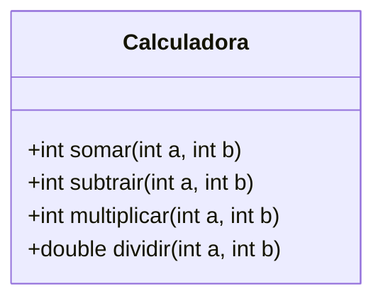

# Roteiro de Estudo e Atividade Prática


## Test‑Driven Development (TDD) com JUnit 5 no IntelliJ IDEA#

### Objetivos de Aprendizagem### Objetivos


Ao final desta atividade, você será capaz de:* Compreender o ciclo **Red‑Green‑Refactor** da metodologia TDD.

* Escrever testes unitários em Java usando o framework **JUnit 5**.

* Compreender os fundamentos e a filosofia da metodologia **Test-Driven Development (TDD)**.* Utilizar o **IntelliJ IDEA** como ambiente de desenvolvimento e execução de testes.

* Aplicar o ciclo **Red‑Green‑Refactor** no desenvolvimento de software.* Implementar e validar a classe **Calculadora**.

* Escrever testes unitários eficazes em Java usando o framework **JUnit 5**.---

* Utilizar o **IntelliJ IDEA** como ambiente de desenvolvimento e execução de testes.

* Implementar e validar funcionalidades guiadas por testes.### Pré‑requisitos

* Reconhecer os benefícios práticos do TDD em projetos reais.

* Java 17 ou superior instalado.

---* IntelliJ IDEA (Community ou Ultimate) instalado.

* Conhecimentos básicos de programação orientada a objetos em Java.

### Pré‑requisitos

---

* Java 17 ou superior instalado.

* IntelliJ IDEA (Community ou Ultimate) instalado.### 1. Introdução rápida ao TDD

* Conhecimentos básicos de programação orientada a objetos em Java.

* Disposição para experimentar uma nova abordagem de desenvolvimento.| Fase         | Ação                                                           | Resultado esperado                                        |

| ------------ | -------------------------------------------------------------- | --------------------------------------------------------- |

---| **Red**      | Escreva um teste que descreva o comportamento desejado.        | O teste **falha** – comportamento ainda não implementado. |

| **Green**    | Implemente o código mínimo para o teste passar.                | O teste **passa** – funcionalidade implementada.          |

## 1. Introdução à Metodologia TDD| **Refactor** | Melhore a estrutura do código mantendo todos os testes verdes. | Código limpo e coberto por testes.                        |


### 1.1 O que é Test-Driven Development?**Benefícios:** menor retrabalho, código auto‑documentado, regressão controlada.


**Test-Driven Development (TDD)** é uma metodologia de desenvolvimento de software criada por Kent Beck no início dos anos 2000, onde os testes são escritos **antes** do código de produção. Em vez de primeiro implementar uma funcionalidade e depois testá-la, invertemos a ordem: primeiro especificamos o comportamento esperado através de um teste, e só então escrevemos o código necessário para satisfazer esse teste.---


> 💡 **Analogia:** Imagine que você está construindo uma casa. No método tradicional, você constrói e depois verifica se tudo está correto. Com TDD, você primeiro define os critérios de qualidade (fundação nivelada, paredes no esquadro, etc.) e só então constrói, verificando continuamente se cada parte atende aos critérios.### 2. Fundamentos do JUnit 5


### 1.2 Filosofia e Princípios do TDD* **Plataforma JUnit**: descobre e executa testes.

* **Módulo Jupiter**: novas anotações (`@Test`, `@BeforeEach`, `@AfterEach`, etc.).

O TDD baseia-se em alguns princípios fundamentais:* **Assertions**: `assertEquals`, `assertThrows`, `assertAll`, entre outras.

* **Integração com IntelliJ**: botão *Run* ao lado do método de teste, cobertura, e depuração.

1. **Escrever apenas código necessário**: Você implementa apenas o suficiente para fazer os testes passarem, evitando código desnecessário (YAGNI - You Aren't Gonna Need It).

---

2. **Design emergente**: A arquitetura do software evolui naturalmente conforme você escreve os testes, resultando em código mais modular e desacoplado.

### 3. Configuração do Projeto no IntelliJ IDEA

3. **Feedback rápido**: Testes automatizados fornecem retorno imediato sobre a qualidade do código.

1. *File ▸ New ▸ Project...* → **Java** → marque **Add Sample Code** *(opcional)*.

4. **Documentação viva**: Os testes servem como documentação executável do comportamento do sistema.2. Selecione o *JDK* 17 ou superior.

3. Escolha **Gradle** ou **Maven**.

5. **Confiança para refatorar**: Com cobertura de testes, você pode melhorar o código sem medo de quebrar funcionalidades existentes.   *Para **Gradle**, adicione em `build.gradle`:*


### 1.3 O Ciclo Red-Green-Refactor   ```groovy

   testImplementation 'org.junit.jupiter:junit-jupiter:5.10.2'

O TDD segue um ciclo repetitivo e disciplinado de três etapas:   test {

       useJUnitPlatform()

| Fase         | Ação                                                           | Resultado esperado                                        | Duração típica |   }

| ------------ | -------------------------------------------------------------- | --------------------------------------------------------- | -------------- |   ```

| **🔴 Red**      | Escreva um teste que descreva o comportamento desejado.        | O teste **falha** – comportamento ainda não implementado. | 1-3 minutos    |4. Clique em *Finish*. O IntelliJ baixa as dependências automaticamente.

| **🟢 Green**    | Implemente o código **mínimo** para o teste passar.                | O teste **passa** – funcionalidade básica implementada.          | 1-5 minutos    |5. Crie o pacote `br.com.exemplo.calculadora`.

| **🔵 Refactor** | Melhore a estrutura do código mantendo todos os testes verdes. | Código limpo, legível e coberto por testes.                        | 2-5 minutos    |

---

#### Detalhamento de cada fase:

### 4. Classe de Domínio

**🔴 Red (Vermelho):**

- Escreva um teste que falha propositalmente.```mermaid

- O teste deve ser pequeno e focar em um único comportamento.classDiagram

- Execute o teste e confirme que ele falha pelo motivo esperado.class Calculadora {

- *"Não há código de produção, então o teste deve falhar"*.  +int somar(int a, int b)

  +int subtrair(int a, int b)

**🟢 Green (Verde):**  +int multiplicar(int a, int b)

- Escreva o código mais simples possível para fazer o teste passar.  +double dividir(int a, int b)

- Não se preocupe com perfeição nesta fase.}

- Execute todos os testes e confirme que passam.```

- *"Faça funcionar, não faça bonito"* (ainda).

> **Regra de negócio**: divisão por zero deve lançar `IllegalArgumentException`.

**🔵 Refactor (Refatorar):**

- Melhore o design do código sem alterar seu comportamento.---

- Elimine duplicação, melhore nomes, extraia métodos.

- Execute os testes após cada mudança.### 5. Passo a Passo da Atividade Prática

- *"Agora faça bonito, mantendo tudo funcionando"*.

| Etapa | Ação                                                                                                | Dica didática                                       |

```mermaid| ----- | --------------------------------------------------------------------------------------------------- | --------------------------------------------------- |

graph LR| 5.1   | Crie a classe `Calculadora`.                                                                        | Mantenha-a *stateless* (sem atributos).             |

    A[🔴 Red<br/>Escrever teste<br/>que falha] --> B[🟢 Green<br/>Implementar código<br/>mínimo]| 5.2   | Em cada método, coloque: <br>`throw new UnsupportedOperationException("Não implementado");`         | **Red** – todos os testes devem falhar.             |

    B --> C[🔵 Refactor<br/>Melhorar<br/>código]| 5.3   | Crie `CalculadoraTest` em `src/test/java`. Use `@DisplayName` para tornar o relatório mais legível. | Utilize o modelo *AAA* (Arrange, Act, Assert).      |

    C --> A| 5.4   | Escreva um teste para **cada** método, incluindo casos de borda (ex.: divisão por zero).            | Use `assertThrows` para exceções.                   |

    style A fill:#ffcccc| 5.5   | Execute a suíte de testes (Ctrl + Shift + F10).                                                     | Verifique o painel *Run* – todos vermelhos.         |

    style B fill:#ccffcc| 5.6   | Implemente a lógica correta na `Calculadora`.                                                       | **Green** – volte a executar os testes.             |

    style C fill:#ccccff| 5.7   | Refatore nomes e extraia métodos comuns mantendo testes verdes.                                     | Ative o plugin *Coverage* para avaliar porcentagem. |

```

---

### 1.4 Objetivos do TDD

#### Exemplo de Teste

O TDD tem como objetivos principais:

```java

1. **Garantir qualidade desde o início**: Código nasce com testes, reduzindo bugs.@DisplayName("Divisão deve lançar exceção quando divisor é zero")

@Test

2. **Melhorar o design**: Escrever testes primeiro força você a pensar em interfaces e contratos antes da implementação.void dividir_divisorZero_deveLancarExcecao() {

    Calculadora calc = new Calculadora();

3. **Aumentar a confiança**: Você sabe que o código funciona porque tem provas automatizadas.    assertThrows(IllegalArgumentException.class,

                 () -> calc.dividir(10, 0),

4. **Facilitar manutenção**: Código testado é mais fácil de entender e modificar.                 "Dividir por zero deveria lançar IllegalArgumentException");

}

5. **Reduzir custo de mudanças**: Detectar problemas cedo é exponencialmente mais barato.```


6. **Documentar comportamento**: Testes são exemplos executáveis de como o código deve ser usado.---


### 1.5 Benefícios Práticos do TDD### 6. Evidências para Entrega


| Benefício | Descrição | Impacto |1. **Print** da janela de testes com falhas (*fase Red*).

|-----------|-----------|---------|2. **Print** da janela de testes bem‑sucedidos (*fase Green*).

| **Menor retrabalho** | Bugs são detectados imediatamente, não em produção. | ⬇️ Redução de 40-80% em bugs |3. Código‑fonte completo de `CalculadoraTest.java` (copiado ou *Export to Text File* do IntelliJ).

| **Código auto-documentado** | Os testes explicam o que o código faz e como usá-lo. | 📚 Menos tempo lendo documentação |

| **Regressão controlada** | Mudanças não quebram funcionalidades existentes. | 🛡️ Deploy mais seguro |> *Dica:* use *Shift + F12* para capturar apenas a janela de resultados no Windows 10+, ou `cmd + shift + 4` no macOS.

| **Design melhor** | Código testável tende a ser mais modular e desacoplado. | 🏗️ Arquitetura mais limpa |

| **Refatoração segura** | Você pode melhorar código com confiança. | 🔧 Manutenção facilitada |---

| **Produtividade** | Menos tempo debugando, mais tempo criando. | ⚡ Velocidade sustentável |

| **Comunicação** | Testes servem como especificação compartilhada. | 🤝 Time alinhado |

### 7. Referências

### 1.6 Quando e Como Usar TDD

* Beck, K. *Test‑Driven Development: By Example*, 2003.

**TDD é especialmente útil para:*** JUnit 5 User Guide: [https://junit.org/junit5/docs/current/user-guide/](https://junit.org/junit5/docs/current/user-guide/)

- ✅ Lógica de negócio complexa* Documentação IntelliJ IDEA: *Testing framework support*.

- ✅ Algoritmos e cálculos
- ✅ Validações e regras
- ✅ APIs e interfaces públicas
- ✅ Código crítico com alto impacto

**TDD pode ser adaptado para:**
- 🔄 Protótipos (versão simplificada)
- 🔄 Código legado (adicionar testes gradualmente)
- 🔄 Integrações (testes de contrato)

**TDD pode não ser ideal para:**
- ⚠️ Interfaces gráficas complexas (use outras técnicas)
- ⚠️ Experimentos descartáveis
- ⚠️ Scripts simples de uso único

### 1.7 Mitos Comuns sobre TDD

| Mito | Realidade |
|------|-----------|
| "TDD deixa o desenvolvimento mais lento" | Inicialmente pode parecer mais lento, mas reduz drasticamente tempo de debug e retrabalho. |
| "Não preciso testar código simples" | Código simples pode ter bugs sutis. Testes dão confiança e documentação. |
| "Testes são responsabilidade do QA" | Testes unitários são parte do desenvolvimento, QA foca em testes de integração e sistema. |
| "100% de cobertura é o objetivo" | Cobertura é uma métrica, não um objetivo. Foque em testar comportamentos críticos. |
| "TDD só funciona em projetos novos" | Pode ser aplicado gradualmente em código legado (técnica: *Strangler Fig Pattern*). |

---

## 2. Fundamentos do JUnit 5

### 2.1 Arquitetura do JUnit 5

O JUnit 5 é composto de três módulos principais:

* **JUnit Platform**: Base que descobre e executa testes. Integração com IDEs e ferramentas de build.
* **JUnit Jupiter**: Motor de testes com novas anotações e funcionalidades (`@Test`, `@BeforeEach`, `@AfterEach`, `@DisplayName`, etc.).
* **JUnit Vintage**: Suporte para executar testes do JUnit 3 e 4 (retrocompatibilidade).

### 2.2 Principais Anotações

| Anotação | Função | Quando usar |
|----------|--------|-------------|
| `@Test` | Marca um método como teste | Em todo método de teste |
| `@DisplayName` | Nome legível para o teste no relatório | Para melhorar clareza dos resultados |
| `@BeforeEach` | Executa antes de cada teste | Preparar dados ou objetos (setup) |
| `@AfterEach` | Executa depois de cada teste | Limpar recursos (cleanup) |
| `@BeforeAll` | Executa uma vez antes de todos os testes | Setup pesado (deve ser static) |
| `@AfterAll` | Executa uma vez depois de todos os testes | Cleanup global (deve ser static) |
| `@Disabled` | Desabilita um teste | Temporariamente ignorar testes |
| `@ParameterizedTest` | Teste com múltiplos parâmetros | Testar múltiplos cenários |

### 2.3 Assertions Principais

* **`assertEquals(expected, actual)`**: Verifica igualdade.
* **`assertTrue(condition)`** / **`assertFalse(condition)`**: Verifica condições booleanas.
* **`assertNull(object)`** / **`assertNotNull(object)`**: Verifica nulidade.
* **`assertThrows(ExceptionClass.class, () -> código)`**: Verifica se exceção é lançada.
* **`assertAll(assertions...)`**: Agrupa múltiplas asserções (executa todas mesmo se alguma falhar).
* **`assertTimeout(duration, () -> código)`**: Verifica se código executa dentro do tempo.

### 2.4 Padrão AAA (Arrange-Act-Assert)

Todo teste bem escrito segue o padrão **AAA (Arrange-Act-Assert)**, que organiza o código de teste em três fases distintas e claras:

#### 2.4.1 As Três Fases do AAA

**🔧 ARRANGE (Preparar/Organizar):**
- Configure o cenário do teste
- Prepare os dados de entrada (fixtures)
- Instancie os objetos necessários
- Configure mocks e stubs (quando necessário)

**⚡ ACT (Agir/Executar):**
- Execute a ação que está sendo testada
- Chame o método sob teste
- Geralmente é uma única linha de código

**✅ ASSERT (Verificar/Afirmar):**
- Verifique se o resultado está correto
- Compare valores esperados com valores reais
- Valide o comportamento do sistema

#### 2.4.2 Exemplo Básico

```java
@Test
@DisplayName("Somar dois números positivos deve retornar a soma correta")
void somar_numerosPositivos_retornaSomaCorreta() {
    // ============ ARRANGE ============
    // Preparar: criar a calculadora e definir os valores
    Calculadora calc = new Calculadora();
    int a = 10;
    int b = 5;
    int valorEsperado = 15;
    
    // ============ ACT ============
    // Agir: executar a operação que queremos testar
    int resultado = calc.somar(a, b);
    
    // ============ ASSERT ============
    // Verificar: confirmar que o resultado está correto
    assertEquals(valorEsperado, resultado, "10 + 5 deveria resultar em 15");
}
```

#### 2.4.3 Por Que Usar o Padrão AAA?

| Benefício | Descrição |
|-----------|-----------|
| **Clareza** | Torna o teste fácil de ler e entender |
| **Organização** | Separa responsabilidades em seções lógicas |
| **Manutenção** | Facilita identificar e corrigir problemas |
| **Comunicação** | Serve como documentação do comportamento esperado |
| **Padronização** | Time segue a mesma estrutura em todos os testes |

#### 2.4.4 Exemplo com Exceção

```java
@Test
@DisplayName("Dividir por zero deve lançar IllegalArgumentException")
void dividir_porZero_deveLancarExcecao() {
    // ============ ARRANGE ============
    Calculadora calc = new Calculadora();
    int numerador = 10;
    int divisorZero = 0;
    
    // ============ ACT & ASSERT ============
    // Quando testamos exceções, Act e Assert ficam juntos
    IllegalArgumentException exception = assertThrows(
        IllegalArgumentException.class,
        () -> calc.dividir(numerador, divisorZero),
        "Divisão por zero deve lançar IllegalArgumentException"
    );
    
    // ASSERT adicional: verificar mensagem da exceção
    assertTrue(exception.getMessage().contains("zero"),
        "Mensagem deve mencionar 'zero'");
}
```

#### 2.4.5 Dicas Importantes

* ✅ **Sempre use comentários AAA** nos seus testes durante o aprendizado
* ✅ **Separe as seções** com linhas em branco para melhor legibilidade
* ✅ **Mantenha o ACT simples**: idealmente uma única linha
* ✅ **Use nomes descritivos** nas variáveis do ARRANGE
* ✅ **Uma asserção principal por teste**: foque em testar um comportamento
* ⚠️ **Evite lógica complexa** na fase ARRANGE (if, loops, etc.)

### 2.5 Integração com IntelliJ IDEA

O IntelliJ oferece:
- ✅ Botão *Run* (▶️) ao lado de cada método de teste
- ✅ Atalho **Ctrl + Shift + F10** para executar testes
- ✅ Painel *Run* com resultados visuais (verde/vermelho)
- ✅ Análise de cobertura de código (*Run with Coverage*)
- ✅ Depuração de testes (breakpoints)
- ✅ Geração automática de métodos de teste

---

## 3. Configuração do Projeto no IntelliJ IDEA

### 3.1 Criando um Novo Projeto

1. Abra o IntelliJ IDEA e clique em **File ▸ New ▸ Project...**

2. Selecione **Java** no painel lateral esquerdo.

3. Configure:
   - **Name**: `CalculadoraTDD`
   - **Location**: escolha um diretório de sua preferência
   - **Language**: Java
   - **Build System**: **Gradle** ou **Maven** (recomendamos Gradle para este tutorial)
   - **JDK**: Selecione a versão 17 ou superior

4. Marque a opção **Add Sample Code** se desejar ver exemplos (opcional).

5. Clique em **Create**.

### 3.2 Configurando o JUnit 5

#### Para Gradle:

Edite o arquivo `build.gradle` e adicione:

```groovy
plugins {
    id 'java'
}

group = 'br.com.exemplo'
version = '1.0-SNAPSHOT'

repositories {
    mavenCentral()
}

dependencies {
    testImplementation 'org.junit.jupiter:junit-jupiter:5.10.2'
}

test {
    useJUnitPlatform()
}
```

#### Para Maven:

Edite o arquivo `pom.xml` e adicione:

```xml
<dependencies>
    <dependency>
        <groupId>org.junit.jupiter</groupId>
        <artifactId>junit-jupiter</artifactId>
        <version>5.10.2</version>
        <scope>test</scope>
    </dependency>
</dependencies>

<build>
    <plugins>
        <plugin>
            <groupId>org.apache.maven.plugins</groupId>
            <artifactId>maven-surefire-plugin</artifactId>
            <version>3.0.0</version>
        </plugin>
    </plugins>
</build>
```

### 3.3 Estrutura de Pacotes

Crie a seguinte estrutura:

```
src/
├── main/
│   └── java/
│       └── br/
│           └── com/
│               └── exemplo/
│                   └── calculadora/
│                       └── Calculadora.java
└── test/
    └── java/
        └── br/
            └── com/
                └── exemplo/
                    └── calculadora/
                        └── CalculadoraTest.java
```

**Dica:** Clique com botão direito em `src/main/java` → **New** → **Package** e digite `br.com.exemplo.calculadora`.

---

## 4. Especificação da Classe de Domínio

### 4.1 Diagrama de Classes



### 4.2 Regras de Negócio

A classe `Calculadora` deve implementar quatro operações matemáticas básicas:

1. **somar(a, b)**: Retorna a soma de dois números inteiros.
2. **subtrair(a, b)**: Retorna a subtração de dois números inteiros.
3. **multiplicar(a, b)**: Retorna a multiplicação de dois números inteiros.
4. **dividir(a, b)**: Retorna a divisão de dois números inteiros como double.

**⚠️ Regra Importante:** A operação de divisão por zero deve lançar `IllegalArgumentException` com mensagem apropriada.

### 4.3 Casos de Teste a Considerar

| Operação | Casos de teste |
|----------|----------------|
| Somar | Números positivos, números negativos, zero |
| Subtrair | Resultado positivo, resultado negativo, subtrair zero |
| Multiplicar | Números positivos, multiplicar por zero, números negativos |
| Dividir | Divisão exata, divisão com resto, **divisão por zero (exceção)** |

---

## 5. Passo a Passo da Atividade Prática

### 5.1 Visão Geral do Processo

Você seguirá o ciclo TDD completo para cada método da calculadora:

1. **Escrever o teste** (Red)
2. **Implementar o código** (Green)
3. **Refatorar** (Refactor)
4. **Repetir** para o próximo método

### 5.2 Etapas Detalhadas

| Etapa | Ação | Dica didática | Fase TDD |
| ----- | ---- | ------------- | -------- |
| **5.2.1** | Crie a classe `Calculadora` no pacote `br.com.exemplo.calculadora`. | Mantenha-a *stateless* (sem atributos de instância). | Setup |
| **5.2.2** | Adicione os quatro métodos (somar, subtrair, multiplicar, dividir). | Em cada método, coloque: `throw new UnsupportedOperationException("Não implementado");` | 🔴 Red |
| **5.2.3** | Crie a classe `CalculadoraTest` em `src/test/java` no mesmo pacote. | Clique com botão direito na classe `Calculadora` → *Generate* → *Test* | Setup |
| **5.2.4** | Escreva o primeiro teste: `testSomar()`. | Use `@DisplayName` para tornar o relatório mais legível. | 🔴 Red |
| **5.2.5** | Execute o teste e **confirme que falha**. | Use **Ctrl + Shift + F10** ou clique no ▶️ verde. | 🔴 Red |
| **5.2.6** | Implemente a lógica do método `somar()`. | Código mais simples possível: `return a + b;` | 🟢 Green |
| **5.2.7** | Execute o teste e **confirme que passa**. | Verifique o painel *Run* – deve ficar verde. | 🟢 Green |
| **5.2.8** | Refatore se necessário (nomes, estrutura). | Mantenha os testes verdes após cada mudança. | 🔵 Refactor |
| **5.2.9** | Repita os passos 5.2.4 a 5.2.8 para os métodos `subtrair()`, `multiplicar()` e `dividir()`. | Um método de cada vez! | Ciclo completo |
| **5.2.10** | Adicione teste para divisão por zero usando `assertThrows`. | Este teste é crucial para validar o tratamento de erro. | 🔴 Red |
| **5.2.11** | Implemente a validação no método `dividir()`. | `if (b == 0) throw new IllegalArgumentException("Divisão por zero");` | 🟢 Green |
| **5.2.12** | Execute **toda a suíte** de testes. | Todos devem estar verdes. Use o atalho de executar todos. | Validação |
| **5.2.13** | Ative a análise de cobertura (*Run with Coverage*). | Meta: 100% de cobertura dos métodos implementados. | Qualidade |

### 5.3 Importância do Padrão AAA nos Testes

**⭐ ATENÇÃO:** Todos os testes que você escrever nesta atividade devem seguir rigorosamente o padrão **AAA (Arrange-Act-Assert)**. Este padrão é fundamental para escrever testes claros, legíveis e manuteníveis.

#### 5.3.1 Por Que AAA é Obrigatório?

O padrão AAA é considerado a melhor prática em testes unitários porque:

| Vantagem | Benefício |
|----------|-----------|
| 📖 **Legibilidade** | Qualquer pessoa pode entender o teste rapidamente |
| 🎯 **Foco** | Cada teste tem um propósito claro e único |
| 🔍 **Debugging** | Fácil identificar onde o problema está (preparação, execução ou verificação) |
| 📚 **Documentação** | O teste serve como exemplo de uso do código |
| 🤝 **Colaboração** | Time segue o mesmo padrão, facilitando revisão de código |

#### 5.3.2 Anatomia do AAA Aplicado à Calculadora

Veja como cada fase do AAA se aplica aos testes da calculadora:

```java
@Test
@DisplayName("Descrição clara do comportamento testado")
void nomeMetodo_cenario_resultado() {
    
    // ==================== ARRANGE ====================
    // 🔧 PREPARAR: O que eu preciso para executar o teste?
    // - Criar ou obter o objeto a ser testado
    // - Definir valores de entrada (dados do teste)
    // - Definir o resultado esperado
    // - Configurar mocks/stubs (em testes mais avançados)
    
    Calculadora calc = calculadora; // objeto da calculadora
    int entrada1 = 10;              // primeiro valor
    int entrada2 = 5;               // segundo valor
    int esperado = 15;              // resultado que esperamos
    
    // ==================== ACT ====================
    // ⚡ AGIR: Qual é a ação principal do teste?
    // - Executar o método que está sendo testado
    // - Geralmente UMA ÚNICA linha de código
    
    int resultado = calc.somar(entrada1, entrada2);
    
    // ==================== ASSERT ====================
    // ✅ VERIFICAR: O resultado está correto?
    // - Comparar resultado obtido com resultado esperado
    // - Verificar se exceções foram lançadas (quando aplicável)
    // - Incluir mensagem explicativa para falhas
    
    assertEquals(esperado, resultado, 
        "A soma de 10 + 5 deveria resultar em 15");
}
```

#### 5.3.3 Erros Comuns a Evitar

❌ **NÃO FAÇA ISSO:**

```java
// ❌ Teste sem estrutura AAA clara
@Test
void testSomar() {
    assertEquals(15, calculadora.somar(10, 5)); // Tudo misturado!
}

// ❌ Teste sem comentários AAA
@Test
void somar_test() {
    int a = 10;
    int b = 5;
    int resultado = calculadora.somar(a, b);
    assertEquals(15, resultado);
}

// ❌ Múltiplas ações no ACT
@Test
void testMultiplo() {
    int r1 = calc.somar(1, 2);      // ❌ Múltiplas
    int r2 = calc.subtrair(5, 3);   // ❌ ações
    assertEquals(3, r1);             // ❌ testadas
    assertEquals(2, r2);             // ❌ juntas!
}
```

✅ **FAÇA ASSIM:**

```java
// ✅ Teste bem estruturado com AAA
@Test
@DisplayName("Somar dois números positivos deve retornar soma correta")
void somar_numerosPositivos_retornaSomaCorreta() {
    // ==================== ARRANGE ====================
    int primeiroNumero = 10;
    int segundoNumero = 5;
    int somaEsperada = 15;
    
    // ==================== ACT ====================
    int resultado = calculadora.somar(primeiroNumero, segundoNumero);
    
    // ==================== ASSERT ====================
    assertEquals(somaEsperada, resultado,
        "A soma de 10 + 5 deve resultar em 15");
}
```

#### 5.3.4 Checklist AAA Obrigatório

**Antes de considerar um teste completo, verifique:**

* ✅ O teste tem os comentários `// ARRANGE`, `// ACT`, `// ASSERT`?
* ✅ A fase ARRANGE prepara TODOS os dados necessários?
* ✅ A fase ACT tem apenas UMA linha executando o método testado?
* ✅ A fase ASSERT verifica APENAS o comportamento sendo testado?
* ✅ As variáveis têm nomes descritivos (não `a`, `b`, mas `primeiroNumero`, `segundoNumero`)?
* ✅ O assertEquals tem uma mensagem explicativa (terceiro parâmetro)?
* ✅ O teste está testando APENAS um comportamento?

#### 5.3.5 Aplicando AAA em Testes de Exceção

Para testes que verificam exceções, o ACT e ASSERT ficam juntos:

```java
@Test
@DisplayName("Dividir por zero deve lançar IllegalArgumentException")
void dividir_porZero_deveLancarExcecao() {
    // ==================== ARRANGE ====================
    int dividendo = 10;
    int divisorZero = 0;
    
    // ==================== ACT & ASSERT ====================
    // Exceções: Act e Assert são combinados
    IllegalArgumentException exception = assertThrows(
        IllegalArgumentException.class,
        () -> calculadora.dividir(dividendo, divisorZero)
    );
    
    // ==================== ASSERT ADICIONAL ====================
    assertTrue(exception.getMessage().contains("zero"));
}
```

**💡 Dica:** Mesmo em testes de exceção, mantenha o ARRANGE separado!

---

### 5.4 Código Inicial da Calculadora (Fase Red)

Crie o arquivo `Calculadora.java`:

```java
package br.com.exemplo.calculadora;

/**
 * Classe que implementa operações matemáticas básicas.
 * Desenvolvida usando TDD (Test-Driven Development).
 */
public class Calculadora {
    
    /**
     * Soma dois números inteiros.
     * @param a primeiro número
     * @param b segundo número
     * @return a soma de a e b
     */
    public int somar(int a, int b) {
        throw new UnsupportedOperationException("Não implementado");
    }
    
    /**
     * Subtrai dois números inteiros.
     * @param a primeiro número
     * @param b segundo número
     * @return a subtração de a menos b
     */
    public int subtrair(int a, int b) {
        throw new UnsupportedOperationException("Não implementado");
    }
    
    /**
     * Multiplica dois números inteiros.
     * @param a primeiro número
     * @param b segundo número
     * @return a multiplicação de a por b
     */
    public int multiplicar(int a, int b) {
        throw new UnsupportedOperationException("Não implementado");
    }
    
    /**
     * Divide dois números inteiros.
     * @param a numerador
     * @param b denominador
     * @return a divisão de a por b como double
     * @throws IllegalArgumentException se b for zero
     */
    public double dividir(int a, int b) {
        throw new UnsupportedOperationException("Não implementado");
    }
}
```

### 5.5 Dicas para Escrever os Testes

Agora é a sua vez! Você deve escrever os testes para a classe `Calculadora`. Siga estas orientações:

**⚠️ LEMBRE-SE:** Todos os testes devem seguir o padrão **AAA (Arrange-Act-Assert)** conforme explicado na seção 5.3!

#### 5.5.1 Estrutura Básica da Classe de Teste

Crie o arquivo `CalculadoraTest.java` no pacote `br.com.exemplo.calculadora` dentro de `src/test/java`:

**Elementos essenciais:**
- Use a anotação `@DisplayName` na classe para dar um nome descritivo
- Declare um atributo privado do tipo `Calculadora`
- Use `@BeforeEach` para instanciar a calculadora antes de cada teste
- Organize os testes em grupos (soma, subtração, multiplicação, divisão)

#### 5.6.2 Convenção de Nomenclatura dos Testes

Siga o padrão: `nomeMetodo_cenario_resultadoEsperado`

**Exemplos:**
- `somar_numerosPositivos_retornaSomaCorreta()`
- `dividir_porZero_deveLancarExcecao()`
- `subtrair_resultandoNegativo_retornaValorNegativo()`

#### 5.6.3 Estrutura de Cada Teste (Padrão AAA)

**⭐ FUNDAMENTAL:** Cada teste deve seguir rigorosamente o padrão **Arrange-Act-Assert (AAA)**. Esta é a base de um teste bem estruturado e legível.

##### Estrutura Geral do AAA

```java
@Test
@DisplayName("Descrição clara e legível do comportamento esperado")
void nomeDoMetodo_cenario_resultadoEsperado() {
    // ==================== ARRANGE ====================
    // Preparação: Configure tudo que o teste precisa
    Calculadora calc = calculadora; // objeto já criado no @BeforeEach
    int a = valorA;
    int b = valorB;
    int esperado = valorEsperado;
    
    // ==================== ACT ====================
    // Ação: Execute o método que está sendo testado
    tipoRetorno resultado = calc.metodo(a, b);
    
    // ==================== ASSERT ====================
    // Verificação: Confirme que o resultado está correto
    assertEquals(esperado, resultado, "Mensagem clara sobre o que deveria acontecer");
}
```

##### Exemplo 1: Teste de Soma com AAA

```java
@Test
@DisplayName("Somar dois números positivos deve retornar a soma correta")
void somar_numerosPositivos_retornaSomaCorreta() {
    // ==================== ARRANGE ====================
    // Preparar os dados do teste
    int primeiroNumero = 10;
    int segundoNumero = 5;
    int somaEsperada = 15;
    
    // ==================== ACT ====================
    // Executar a operação de soma
    int resultado = calculadora.somar(primeiroNumero, segundoNumero);
    
    // ==================== ASSERT ====================
    // Verificar se o resultado é o esperado
    assertEquals(somaEsperada, resultado, 
        "A soma de 10 + 5 deve resultar em 15");
}
```

##### Exemplo 2: Teste de Subtração com AAA

```java
@Test
@DisplayName("Subtrair resultando em número negativo")
void subtrair_resultandoNegativo_retornaValorNegativo() {
    // ==================== ARRANGE ====================
    int minuendo = 5;
    int subtraendo = 10;
    int diferencaEsperada = -5;
    
    // ==================== ACT ====================
    int resultado = calculadora.subtrair(minuendo, subtraendo);
    
    // ==================== ASSERT ====================
    assertEquals(diferencaEsperada, resultado,
        "5 - 10 deve resultar em -5");
}
```

##### Exemplo 3: Teste de Multiplicação com AAA

```java
@Test
@DisplayName("Multiplicar por zero deve retornar zero")
void multiplicar_porZero_retornaZero() {
    // ==================== ARRANGE ====================
    int numero = 42;
    int zero = 0;
    int produtoEsperado = 0;
    
    // ==================== ACT ====================
    int resultado = calculadora.multiplicar(numero, zero);
    
    // ==================== ASSERT ====================
    assertEquals(produtoEsperado, resultado,
        "Qualquer número multiplicado por zero deve resultar em zero");
}
```

##### Exemplo 4: Teste de Divisão com AAA (com decimais)

```java
@Test
@DisplayName("Dividir com resultado decimal")
void dividir_comResto_retornaQuocienteDecimal() {
    // ==================== ARRANGE ====================
    int dividendo = 10;
    int divisor = 3;
    double quocienteEsperado = 3.3333;
    double tolerancia = 0.0001; // delta para comparação de doubles
    
    // ==================== ACT ====================
    double resultado = calculadora.dividir(dividendo, divisor);
    
    // ==================== ASSERT ====================
    assertEquals(quocienteEsperado, resultado, tolerancia,
        "10 dividido por 3 deve resultar em aproximadamente 3.3333");
}
```

##### Exemplo 5: Teste de Exceção com AAA

```java
@Test
@DisplayName("Dividir por zero deve lançar IllegalArgumentException")
void dividir_porZero_deveLancarExcecao() {
    // ==================== ARRANGE ====================
    int dividendo = 10;
    int divisorZero = 0;
    
    // ==================== ACT & ASSERT ====================
    // Para exceções, Act e Assert ficam juntos
    IllegalArgumentException exception = assertThrows(
        IllegalArgumentException.class,
        () -> calculadora.dividir(dividendo, divisorZero),
        "Divisão por zero deve lançar IllegalArgumentException"
    );
    
    // ==================== ASSERT ADICIONAL ====================
    // Verificar a mensagem da exceção
    String mensagem = exception.getMessage();
    assertTrue(mensagem.contains("zero") || mensagem.contains("Zero"),
        "A mensagem de erro deve mencionar 'zero'");
}
```

##### Checklist do Padrão AAA

Ao escrever cada teste, verifique:

* ✅ **ARRANGE está claro?** Todos os dados necessários estão preparados?
* ✅ **ACT é simples?** Idealmente uma única linha executando o método?
* ✅ **ASSERT é específico?** Verifica exatamente o comportamento esperado?
* ✅ **Comentários AAA presentes?** Ajuda na leitura e aprendizado?
* ✅ **Mensagem descritiva?** O terceiro parâmetro do assertEquals explica o que deveria acontecer?
* ✅ **Nomes significativos?** Variáveis com nomes que explicam seu propósito?

##### Dicas para Dominar o AAA

1. **Sempre comente as seções AAA** enquanto estiver aprendendo
2. **Use linhas em branco** para separar visualmente as três fases
3. **Mantenha o ACT simples**: se precisar de múltiplas linhas, considere refatorar
4. **Um comportamento por teste**: não teste soma e subtração no mesmo método
5. **Variáveis com nomes descritivos**: `numeroPositivo`, `numeroNegativo`, `valorEsperado`

#### 5.6.4 Testes Obrigatórios para Cada Operação

**Para o método `somar()`:**
1. ✅ Somar dois números positivos
2. ✅ Somar número positivo e negativo
3. ✅ Somar com zero

**Para o método `subtrair()`:**
1. ✅ Subtrair dois números positivos (resultado positivo)
2. ✅ Subtrair resultando em número negativo
3. ✅ Subtrair zero

**Para o método `multiplicar()`:**
1. ✅ Multiplicar dois números positivos
2. ✅ Multiplicar por zero
3. ✅ Multiplicar dois números negativos (resultado positivo)

**Para o método `dividir()`:**
1. ✅ Divisão exata (resultado sem casas decimais)
2. ✅ Divisão com resultado decimal
3. ✅ Divisão de número negativo por positivo
4. ✅ **Divisão por zero (deve lançar exceção)** ⚠️

#### 5.6.5 Testando Exceções

Para testar se a divisão por zero lança exceção, use `assertThrows`:

```java
@Test
@DisplayName("Dividir por zero deve lançar exceção")
void dividir_porZero_deveLancarExcecao() {
    // Arrange
    int a = 10;
    int b = 0;
    
    // Act & Assert
    IllegalArgumentException exception = assertThrows(
        IllegalArgumentException.class,
        () -> calculadora.dividir(a, b),
        "Mensagem se o teste falhar"
    );
    
    // Opcional: verificar mensagem da exceção
    assertTrue(exception.getMessage().contains("zero"));
}
```

#### 5.6.6 Testando Números Decimais

Para testar o método `dividir()` que retorna `double`, use um delta (tolerância):

```java
assertEquals(valorEsperado, resultado, 0.0001, "mensagem");
//                                      ^^^^^^
//                                      delta (tolerância)
```

**Exemplo:** `assertEquals(3.3333, resultado, 0.0001, "10/3 deveria ser ~3.3333");`

#### 5.6.7 Imports Necessários

Não esqueça de adicionar os imports no topo do arquivo:

```java
import org.junit.jupiter.api.BeforeEach;
import org.junit.jupiter.api.DisplayName;
import org.junit.jupiter.api.Test;
import static org.junit.jupiter.api.Assertions.*;
```

#### 5.6.8 Checklist de Verificação

Antes de executar os testes, verifique se:

- [ ] A classe de teste está no pacote correto (`br.com.exemplo.calculadora`)
- [ ] A classe de teste está no diretório `src/test/java`
- [ ] Todos os métodos de teste têm a anotação `@Test`
- [ ] Você está usando `@DisplayName` para nomes legíveis
- [ ] Cada teste segue o padrão AAA (Arrange-Act-Assert)
- [ ] Você tem pelo menos 3-4 testes por operação matemática
- [ ] O teste de divisão por zero usa `assertThrows`
- [ ] Os imports estão corretos

#### 5.6.9 Exemplos Completos de Testes com AAA

Aqui estão **alguns exemplos** para você começar. Use-os como referência, mas escreva os demais testes por conta própria seguindo o mesmo padrão AAA.

##### Exemplo 1: Teste Básico de Soma

```java
@Test
@DisplayName("Somar dois números positivos deve retornar a soma correta")
void somar_numerosPositivos_retornaSomaCorreta() {
    // ==================== ARRANGE ====================
    // Preparar: definir os números e o resultado esperado
    int primeiroNumero = 10;
    int segundoNumero = 5;
    int somaEsperada = 15;
    
    // ==================== ACT ====================
    // Agir: executar a operação de soma
    int resultado = calculadora.somar(primeiroNumero, segundoNumero);
    
    // ==================== ASSERT ====================
    // Verificar: confirmar que o resultado está correto
    assertEquals(somaEsperada, resultado, 
        "A soma de 10 + 5 deve resultar em 15");
}
```

##### Exemplo 2: Teste com Zero

```java
@Test
@DisplayName("Somar com zero deve retornar o próprio número")
void somar_comZero_retornaNumeroOriginal() {
    // ==================== ARRANGE ====================
    int numero = 42;
    int zero = 0;
    int resultadoEsperado = 42;
    
    // ==================== ACT ====================
    int resultado = calculadora.somar(numero, zero);
    
    // ==================== ASSERT ====================
    assertEquals(resultadoEsperado, resultado,
        "Somar qualquer número com zero deve retornar o próprio número");
}
```

##### Exemplo 3: Teste com Números Negativos

```java
@Test
@DisplayName("Multiplicar dois números negativos deve retornar positivo")
void multiplicar_doisNegativos_retornaPositivo() {
    // ==================== ARRANGE ====================
    int primeiroNegativo = -4;
    int segundoNegativo = -5;
    int produtoEsperado = 20; // negativo × negativo = positivo
    
    // ==================== ACT ====================
    int resultado = calculadora.multiplicar(primeiroNegativo, segundoNegativo);
    
    // ==================== ASSERT ====================
    assertEquals(produtoEsperado, resultado,
        "Multiplicação de dois números negativos deve resultar em positivo");
}
```

##### Exemplo 4: Teste de Divisão com Decimal

```java
@Test
@DisplayName("Dividir números com resultado decimal")
void dividir_comResto_retornaQuocienteDecimal() {
    // ==================== ARRANGE ====================
    int dividendo = 10;
    int divisor = 3;
    double quocienteEsperado = 3.3333;
    double tolerancia = 0.0001; // precisão para comparação de doubles
    
    // ==================== ACT ====================
    double resultado = calculadora.dividir(dividendo, divisor);
    
    // ==================== ASSERT ====================
    assertEquals(quocienteEsperado, resultado, tolerancia,
        "10 ÷ 3 deve resultar em aproximadamente 3.3333");
}
```

##### Exemplo 5: Teste de Exceção (IMPORTANTE!)

```java
@Test
@DisplayName("Dividir por zero deve lançar IllegalArgumentException")
void dividir_porZero_deveLancarExcecao() {
    // ==================== ARRANGE ====================
    int numerador = 10;
    int denominadorZero = 0;
    
    // ==================== ACT & ASSERT ====================
    // Para testes de exceção, Act e Assert são combinados
    IllegalArgumentException exception = assertThrows(
        IllegalArgumentException.class,
        () -> calculadora.dividir(numerador, denominadorZero),
        "Divisão por zero deve lançar IllegalArgumentException"
    );
    
    // ==================== ASSERT ADICIONAL ====================
    // Verificar que a mensagem de erro é apropriada
    String mensagemErro = exception.getMessage();
    assertTrue(
        mensagemErro.toLowerCase().contains("zero"),
        "A mensagem de erro deve mencionar 'zero'"
    );
}
```

##### Por Que Estes Exemplos Seguem AAA?

Cada exemplo acima demonstra:

1. **📋 ARRANGE claro**: Variáveis com nomes descritivos (`primeiroNumero`, `somaEsperada`)
2. **⚡ ACT simples**: Uma única linha executando o método testado
3. **✅ ASSERT específico**: Mensagem explicativa sobre o comportamento esperado
4. **📝 Comentários AAA**: Seções claramente marcadas para facilitar leitura

##### Sua Missão

**Agora é com você!** Use estes exemplos como guia e escreva os testes restantes:

* ✏️ Mais 1-2 testes para `somar()` (com números negativos, por exemplo)
* ✏️ 2-3 testes para `subtrair()` (positivos, negativos, com zero)
* ✏️ 2-3 testes para `multiplicar()` (positivos, por zero, negativos)
* ✏️ 2-3 testes para `dividir()` (exata, decimal, negativo)

**Lembre-se:** Sempre siga o padrão AAA em TODOS os seus testes!

---

### 5.6 Dicas para Implementar a Calculadora

Após escrever **todos os testes** e vê-los falhar (fase Red), chegou a hora de implementar o código. Siga estas orientações:

#### 5.6.1 Princípios para a Implementação

**Regra de Ouro do TDD:** Escreva apenas o código necessário para fazer os testes passarem!

* ✅ Mantenha a implementação simples e direta
* ✅ Não adicione funcionalidades que não foram testadas
* ✅ Foque em fazer um teste passar por vez
* ✅ Execute os testes após cada alteração

#### 5.6.2 Dicas por Operação

**Método `somar(int a, int b)`:**
* Operação mais simples: retorne a soma dos parâmetros
* Não precisa de validações especiais
* Uma única linha de código resolve

**Método `subtrair(int a, int b)`:**
* Similar ao somar: retorne a subtração
* Não se preocupe com overflow neste exercício
* Uma única linha de código resolve

**Método `multiplicar(int a, int b)`:**
* Similar aos anteriores: retorne a multiplicação
* Não precisa validar multiplicação por zero (já funciona naturalmente)
* Uma única linha de código resolve

**Método `dividir(int a, int b)`:**
* ⚠️ **ATENÇÃO:** Este método requer validação!
* Antes de dividir, verifique se `b` é igual a zero
* Se for zero, lance `IllegalArgumentException` com mensagem apropriada
* Use casting para `double` para obter resultado decimal: `(double) a / b`
* Estrutura sugerida:
  1. Verificar se divisor é zero → lançar exceção
  2. Caso contrário, retornar divisão com casting

#### 5.6.3 Validação de Divisão por Zero

Para o método `dividir()`, você **deve** validar:

```java
// Pseudocódigo - adapte para Java
SE b == 0 ENTÃO
    LANÇAR IllegalArgumentException COM mensagem "Não é possível dividir por zero"
SENÃO
    RETORNAR divisão de a por b (como double)
FIM SE
```

**Dica:** Use o comando `if` e `throw new IllegalArgumentException("mensagem")`

#### 5.6.4 Sobre o Retorno do Método `dividir()`

O método `dividir()` retorna `double` (não `int`), então você precisa:

1. Fazer **casting** de pelo menos um dos operandos para `double`
2. A operação automaticamente retornará `double`

**Exemplo de casting:** `(double) numeroInteiro`

#### 5.6.5 Ordem de Implementação Sugerida

Siga esta ordem para facilitar o aprendizado:

1. **Primeiro:** Implemente `somar()` → Execute os testes de soma
2. **Segundo:** Implemente `subtrair()` → Execute os testes de subtração  
3. **Terceiro:** Implemente `multiplicar()` → Execute os testes de multiplicação
4. **Quarto:** Implemente `dividir()` → Execute os testes de divisão

Sempre execute os testes após implementar cada método!

#### 5.6.6 Checklist de Verificação da Implementação

Antes de considerar concluído, verifique:

- [ ] Todos os quatro métodos foram implementados
- [ ] Nenhum método está lançando `UnsupportedOperationException`
- [ ] O método `dividir()` valida divisão por zero
- [ ] A exceção lançada é `IllegalArgumentException`
- [ ] Todos os testes estão passando (verdes)
- [ ] O código está simples e direto (sem complexidade desnecessária)
- [ ] Você executou a análise de cobertura e atingiu 100%

#### 5.6.7 Exemplo de Estrutura (NÃO COPIE, ADAPTE!)

Este é apenas um guia estrutural. **Você deve escrever o código:**

```java
public class Calculadora {
    
    public int somar(int a, int b) {
        // TODO: Retorne a soma de a e b
    }
    
    public int subtrair(int a, int b) {
        // TODO: Retorne a subtração de a menos b
    }
    
    public int multiplicar(int a, int b) {
        // TODO: Retorne a multiplicação de a por b
    }
    
    public double dividir(int a, int b) {
        // TODO: Valide se b é zero e lance exceção se necessário
        // TODO: Retorne a divisão de a por b como double
    }
}
```

#### 5.6.8 Mensagem de Erro da Exceção

A mensagem da exceção deve ser clara e descritiva. Sugestões:

* "Não é possível dividir por zero"
* "Divisão por zero não é permitida"  
* "O divisor não pode ser zero"

Escolha uma que faça sentido para você.

### 5.7 Dicas de Refatoração

Na fase de Refactor, considere:

1. **Nomes descritivos**: Métodos e variáveis devem explicar sua intenção.
2. **Eliminar duplicação**: Se vários testes repetem código, extraia para `@BeforeEach`.
3. **Mensagens claras**: As mensagens de asserção devem facilitar o debug.
4. **Organize por funcionalidade**: Use comentários para separar grupos de testes.
5. **Considere testes parametrizados**: Para múltiplos cenários similares, use `@ParameterizedTest`.

**Exemplo de teste parametrizado** (opcional, mais avançado):

```java
@ParameterizedTest
@DisplayName("Somar vários casos")
@CsvSource({
    "1, 1, 2",
    "10, 5, 15",
    "-5, 3, -2",
    "0, 0, 0"
})
void somar_variosValores_retornaSomaCorreta(int a, int b, int esperado) {
    assertEquals(esperado, calculadora.somar(a, b));
}
```

---

## 6. Evidências para Entrega

Para comprovar que você seguiu a metodologia TDD corretamente, você deve fornecer:

### 6.1 Capturas de Tela Obrigatórias

1. **Print da Fase Red (Testes Falhando)**
   - Mostre a janela de testes do IntelliJ com testes vermelhos (falhando)
   - Deve ser visível que os testes estão falhando devido a `UnsupportedOperationException`
   - **Dica Windows:** Pressione `Win + Shift + S` para captura de tela parcial

2. **Print da Fase Green (Testes Passando)**
   - Mostre a janela de testes do IntelliJ com todos os testes verdes (passando)
   - Deve ser visível o número total de testes executados com sucesso
   - **Dica macOS:** Pressione `Cmd + Shift + 4` para captura de tela

3. **Print da Cobertura de Código** (opcional, mas recomendado)
   - Execute *Run with Coverage* no IntelliJ
   - Mostre a porcentagem de cobertura da classe `Calculadora`
   - Meta: 100% de cobertura dos métodos

### 6.2 Arquivos de Código

Forneça os seguintes arquivos:

1. **`Calculadora.java`** (versão final)
2. **`CalculadoraTest.java`** (versão completa com todos os testes)
3. **`build.gradle`** ou **`pom.xml`** (configuração do projeto)

**Como exportar do IntelliJ:**
- Clique com botão direito no arquivo → *Copy Path/Reference* → *Absolute Path*
- Ou use *File* → *Export to Text File*

### 6.3 Documento de Reflexão (opcional)

Escreva um breve texto (1-2 parágrafos) respondendo:

1. Qual foi sua maior dificuldade ao aplicar TDD?
2. Você percebeu algum benefício em escrever os testes antes?
3. Como você acha que TDD pode ajudar em projetos maiores?

---

## 7. Comandos e Atalhos Úteis

### 7.1 Atalhos do IntelliJ IDEA

| Atalho | Ação |
|--------|------|
| `Ctrl + Shift + F10` | Executar testes do arquivo atual |
| `Ctrl + Shift + F9` | Recompilar o projeto |
| `Alt + Shift + F10` | Selecionar configuração para executar |
| `Shift + F10` | Executar última configuração |
| `Ctrl + F5` | Re-executar testes |
| `Ctrl + Alt + L` | Reformatar código |
| `Ctrl + Shift + T` | Navegar entre classe e teste |
| `Alt + Enter` | Ações rápidas (criar teste, importar, etc.) |

### 7.2 Executando Testes via Linha de Comando

**Gradle:**
```bash
# Executar todos os testes
./gradlew test

# Executar com relatório
./gradlew test --info

# Limpar e testar
./gradlew clean test
```

**Maven:**
```bash
# Executar todos os testes
mvn test

# Executar com detalhes
mvn test -X

# Limpar e testar
mvn clean test
```

---

## 8. Troubleshooting (Resolução de Problemas)

### 8.1 Problemas Comuns

| Problema | Causa Provável | Solução |
|----------|----------------|---------|
| "Cannot resolve symbol JUnit" | Dependência não baixada | Clique em *File* → *Reload All Gradle Projects* ou *Maven* → *Reload Project* |
| Testes não aparecem no menu | Classe não está em `src/test/java` | Mova a classe de teste para o diretório correto |
| Testes não executam | `test { useJUnitPlatform() }` ausente | Adicione ao `build.gradle` (Gradle) |
| "Method not found" | Import incorreto | Verifique: `import static org.junit.jupiter.api.Assertions.*;` |
| Cobertura mostra 0% | Execução sem Coverage | Use *Run* → *Run with Coverage* |

### 8.2 Validação da Configuração

Execute este teste simples para validar que tudo está funcionando:

```java
import org.junit.jupiter.api.Test;
import static org.junit.jupiter.api.Assertions.assertTrue;

class ConfigTest {
    @Test
    void junitEstaFuncionando() {
        assertTrue(true, "Se você está vendo isso, JUnit está funcionando!");
    }
}
```

---

## 9. Exercícios Adicionais (Desafio)

Após concluir a atividade básica, expanda seu conhecimento:

### 9.1 Adicionar Mais Operações

Aplique TDD para implementar:

1. **Potenciação**: `double potencia(int base, int expoente)`
   - Casos de teste: expoente zero, negativo, positivo

2. **Raiz Quadrada**: `double raizQuadrada(int numero)`
   - Casos de teste: número positivo, zero, número negativo (deve lançar exceção)

3. **Módulo (resto)**: `int modulo(int a, int b)`
   - Casos de teste: divisão exata, com resto, divisor zero (exceção)

### 9.2 Implementar Calculadora Científica

Crie uma nova classe `CalculadoraCientifica` com:

- Logaritmo natural
- Seno, cosseno, tangente
- Conversão graus ↔ radianos

**Lembre-se:** Escreva o teste primeiro! (TDD)

### 9.3 Testes Parametrizados

Refatore os testes para usar `@ParameterizedTest` e `@CsvSource`, reduzindo duplicação.

---

## 10. Recursos de Aprendizagem Adicionais

### 10.1 Livros Recomendados

* **Beck, Kent.** *Test-Driven Development: By Example*. Addison-Wesley, 2003.
  - O livro clássico que introduziu TDD ao mundo.

* **Freeman, Steve & Pryce, Nat.** *Growing Object-Oriented Software, Guided by Tests*. Addison-Wesley, 2009.
  - TDD aplicado a sistemas maiores.

* **Martin, Robert C.** *Clean Code: A Handbook of Agile Software Craftsmanship*. Prentice Hall, 2008.
  - Boas práticas de codificação, incluindo testes.

### 10.2 Documentação Oficial

* **JUnit 5 User Guide**: [https://junit.org/junit5/docs/current/user-guide/](https://junit.org/junit5/docs/current/user-guide/)
* **IntelliJ IDEA Testing**: [https://www.jetbrains.com/help/idea/testing.html](https://www.jetbrains.com/help/idea/testing.html)
* **Gradle Testing**: [https://docs.gradle.org/current/userguide/java_testing.html](https://docs.gradle.org/current/userguide/java_testing.html)

### 10.3 Tutoriais e Vídeos

* **JUnit 5 Tutorial (Baeldung)**: [https://www.baeldung.com/junit-5](https://www.baeldung.com/junit-5)
* **TDD in Java (YouTube)**: Procure por "TDD Java Tutorial" para diversos vídeos práticos
* **Refactoring.Guru**: [https://refactoring.guru/](https://refactoring.guru/) - Padrões e refatoração

### 10.4 Prática Contínua

* **Coding Dojo**: Pratique TDD em grupo com katas (exercícios curtos)
* **Exercism.io**: Plataforma com exercícios de programação e mentoria
* **HackerRank / LeetCode**: Resolva problemas usando TDD

---

## 11. Critérios de Avaliação

Sua atividade será avaliada com base nos seguintes critérios:

| Critério | Pontuação | Descrição |
|----------|-----------|-----------|
| **Aplicação do TDD** | 30% | Evidências claras das fases Red, Green, Refactor |
| **Qualidade dos Testes** | 25% | Testes bem nomeados, cobrem casos importantes, usam AAA |
| **Implementação Correta** | 20% | Código funciona e atende às especificações |
| **Cobertura de Código** | 10% | Porcentagem de código testado (meta: ≥ 90%) |
| **Tratamento de Exceções** | 10% | Divisão por zero tratada corretamente |
| **Documentação** | 5% | Código comentado e evidências bem apresentadas |

**Nota:** A comprovação de que você seguiu TDD (prints Red/Green) é **essencial** para pontuação total.

---

## 12. Considerações Finais

### 12.1 Pontos-chave para Lembrar

✅ **TDD não é sobre testar, é sobre design**: Os testes guiam a criação de código mais limpo e modular.

✅ **Pequenos passos são melhores**: Não tente fazer tudo de uma vez. Um teste, uma implementação, uma refatoração por vez.

✅ **Testes são código**: Mantenha seus testes limpos e organizados tanto quanto seu código de produção.

✅ **Falhar primeiro é importante**: Se o teste não falha inicialmente, você não tem certeza se está testando o que pensa que está.

✅ **Refatorar é obrigatório**: Não pule a fase de refatoração. É onde a mágica acontece.

### 12.2 Próximos Passos

Após dominar TDD básico:

1. Estude **Mocks e Stubs** (Mockito)
2. Aprenda **Testes de Integração**
3. Explore **BDD** (Behavior-Driven Development)
4. Pratique **Continuous Integration** com testes automatizados
5. Aplique TDD em **projetos reais**

### 12.3 Mensagem Final

> *"O maior valor do TDD não está nos testes que você escreve, mas no código que você **não** escreve por causa deles."*
> — Anônimo

TDD pode parecer estranho no início, mas com prática se torna uma segunda natureza. Você começará a pensar naturalmente em termos de comportamentos esperados antes de escrever código. Seja paciente consigo mesmo e continue praticando!

**Boa sorte e bons testes!** 🚀

---

## 13. Referências Bibliográficas

* BECK, Kent. **Test-Driven Development: By Example**. Addison-Wesley Professional, 2003.

* FREEMAN, Steve; PRYCE, Nat. **Growing Object-Oriented Software, Guided by Tests**. Addison-Wesley Professional, 2009.

* MARTIN, Robert C. **Clean Code: A Handbook of Agile Software Craftsmanship**. Prentice Hall, 2008.

* FOWLER, Martin. **Refactoring: Improving the Design of Existing Code**. 2nd Edition. Addison-Wesley Professional, 2018.

* **JUnit 5 User Guide**. JUnit Team. Disponível em: [https://junit.org/junit5/docs/current/user-guide/](https://junit.org/junit5/docs/current/user-guide/). Acesso em: outubro de 2025.

* **IntelliJ IDEA Documentation - Testing**. JetBrains. Disponível em: [https://www.jetbrains.com/help/idea/testing.html](https://www.jetbrains.com/help/idea/testing.html). Acesso em: outubro de 2025.

---

**Documento revisado e expandido para fins didáticos.**  
**Versão 2.0 - Outubro de 2025**


